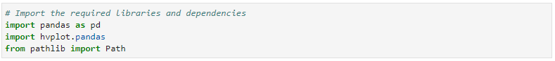

# Proptech_SF

___
In this project, I assume the role of an analyst at a Proptech (Proptech is the application of technology to real-estate markets, is an innovative domain in the fintech industry) company that wants to offer an instant, one-click service for people to buy properties and then rent them. The company wants to have a trial of this offering in the San Francisco real-estate market. If the service proves popular, they can then expand to other markets. is to build a tool.

My role during this project is to utilize my data visualization skills, including aggregation, interactive visualizations, and geospatial analysis, to find properties in the San Francisco market that are viable investment opportunities.

As such, I will create a Jupyter notebook that contains my analysis of the housing rental market data for San Francisco. The analysis will be complete with professionally styled and formatted interactive visualizations.

---

## Technologies

This project leverages python 3.7 with various Libraries and IDE:

* [Jupyterlab](http://justinbois.github.io/bootcamp/2020_fsri/lessons/l01_welcome.html#Jupyter) - An interactive development environment

* [PyViz](https://pyviz.org/overviews/index.html) - a is a Python visualization package that provides a single platform for accessing multiple visualization libraries, including hvPlot and GeoViews.

* [hvPlot](https://hvplot.holoviz.org/user_guide/Plotting.html) -  a high-level plotting API built on HoloViews that provides a general and consistent API for plotting data in various formats.

* [GeoViews](https://geoviews.org/index.html) - a Python library that makes it  easy to explore and visualize geographical, meteorological, and oceanographic datasets.

---

## Installation Guide

In order to run the application, one should first install PyViz as it includes hvPlot and GeoViews. 

* Install PyViz

* Check dependencies

---

## Usage
To use the analysis, clone the repository and run the san_francisco_housing.ipynb notebook within the Jupyter Notebook.

---

## Contributors

Brought to you by Franco Thomas via the Columbia Engineering FinTech Bootcamp.

Significant contributions made by subcontractors Professor Marghub Mirza, TA Ashfaque, and TA Boomin Kwon.

---

## License

MIT